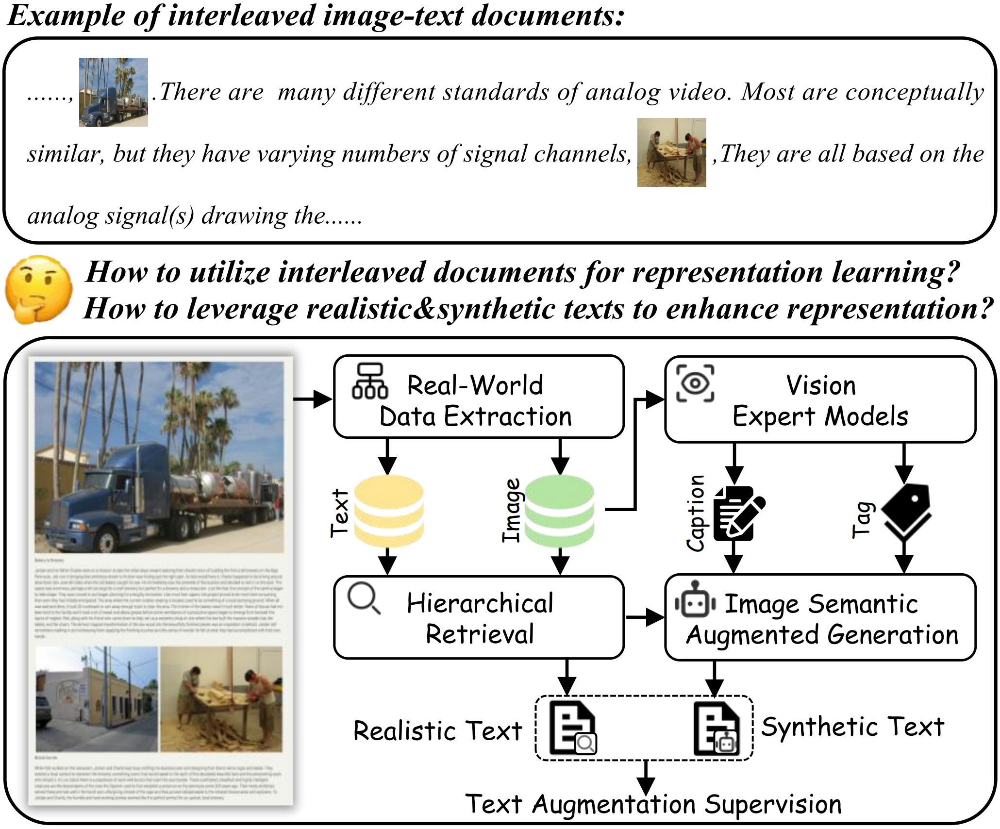
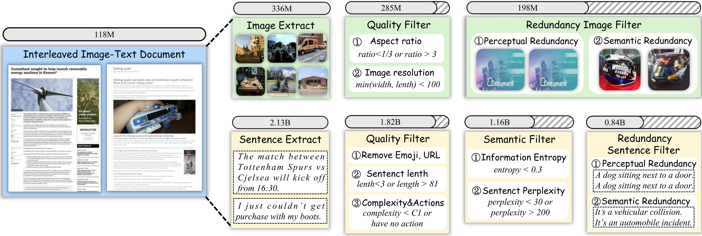
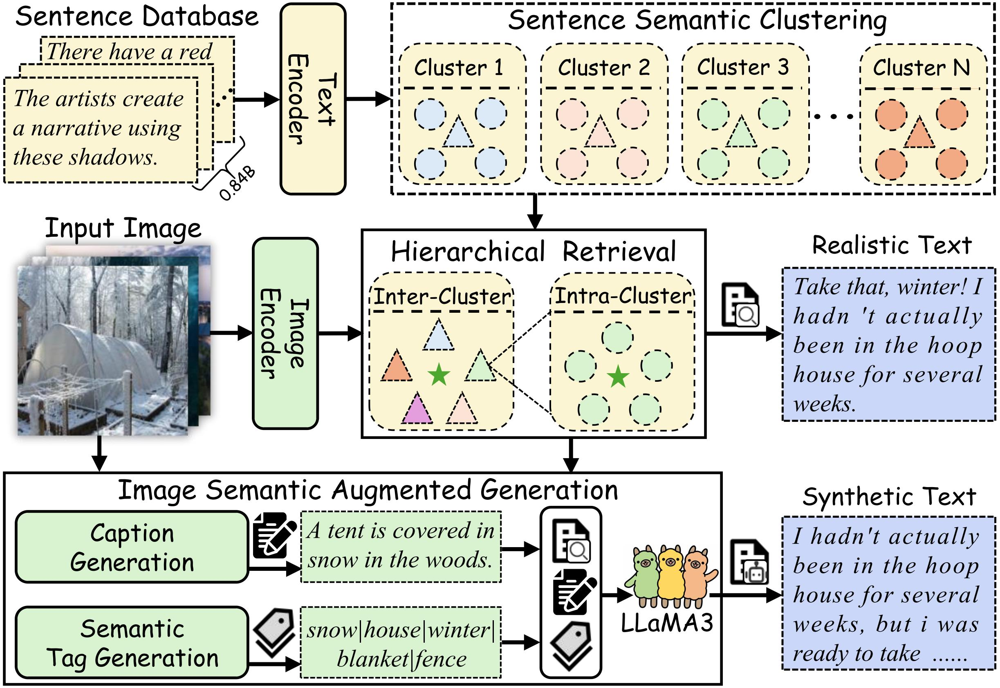
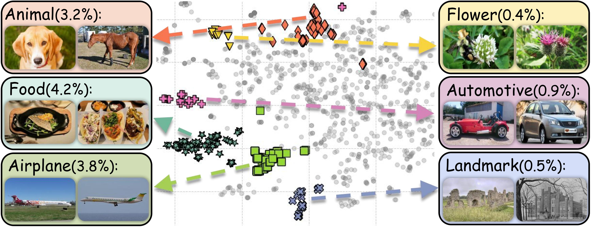
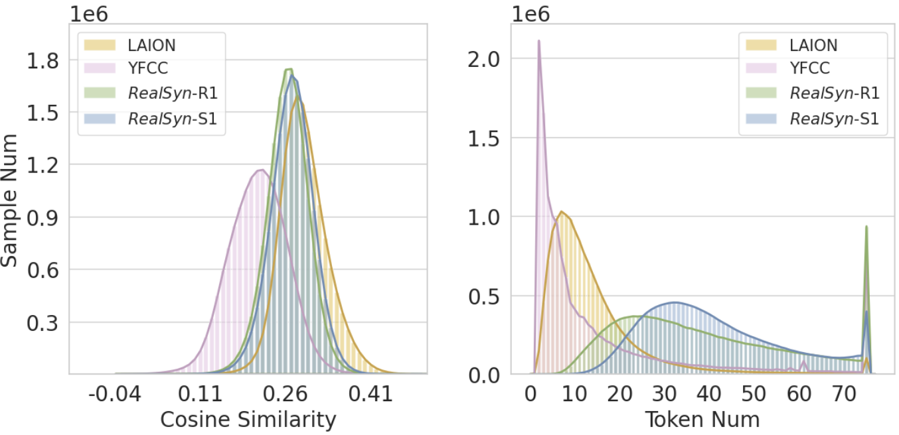
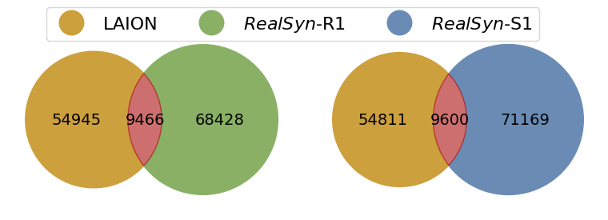
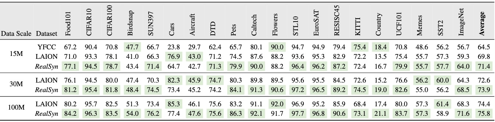
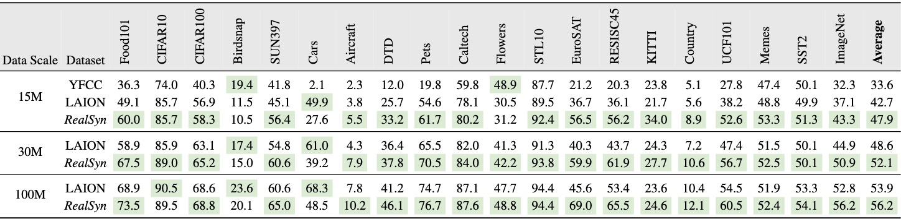
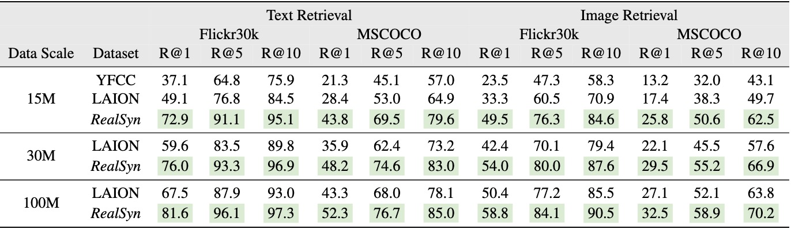

<p align="center">
    
</p>

## *RealSyn*: An Effective and Scalable Multimodal Interleaved Document Transformation Paradigm

<a href="https://github.com/GaryGuTC">Tiancheng Gu</a>,</span>
<a href="https://kaicheng-yang0828.github.io">Kaicheng Yang</a>,</span>
Chaoyi Zhang,</span>
Yin Xie,</span>
<a href="https://github.com/anxiangsir">Xiang An</a>,</span>
Ziyong Feng,</span>
<a href="https://scholar.google.com/citations?user=JZzb8XUAAAAJ&hl=zh-CN">Dongnan Liu</a>,</span>
<a href="https://weidong-tom-cai.github.io/">Weidong Cai</a>,</span>
<a href="https://jiankangdeng.github.io">Jiankang Deng</a></span>

[
](https://huggingface.co/datasets/Kaichengalex/RealSyn100M)


## 📣 News
- [2025/02/18]:✨The *RealSyn* Dataset has been released in [🤗Hugging Face](https://huggingface.co/datasets/Kaichengalex/RealSyn100M).
- [2025/02/18]:✨The paper of *RealSyn* has submitted to [arXiv](https://arxiv.org/pdf/2502.12513).

## 💡 Introduction
<p align="center">
    
</p>

Contrastive Language-Image Pre-training (CLIP) demonstrates promising performance on a wide variety of benchmarks. However, a substantial volume of non-paired data, such as multimodal interleaved documents, remains underutilized for vision-language representation learning. 
<p align="center">
    
</p>

To fully leverage these unpaired documents, we initially establish a Real-World Data Extraction pipeline to extract high-quality images and texts. 
<p align="center">
    
</p>

Then we design a hierarchical retrieval method to efficiently associate each image with multiple semantically relevant realistic texts. To further enhance fine-grained visual information, we propose an image semantic augmented generation module for synthetic text production. Furthermore, we employ a semantic balance sampling strategy to improve dataset diversity, enabling better learning of long-tail concepts. Based on these innovations, we construct *RealSyn*, a dataset combining realistic and synthetic texts, available in three scales: 15M, 30M, and 100M. Extensive experiments demonstrate that *RealSyn* effectively advances vision-language representation learning and exhibits strong scalability.

## 💻 Dataset Information
### Topic Assessment
<p align="center">
    
</p>
We ran LDA on random sampling 1M image-realistic text pairs with 30 topics. The above figure presents the proportions and examples for six topics: animal, food, airplane, flower, automotive, and landmark.

### Richness Assessment
<p align="center">
    
</p>

We presents image-text similarity and text token distribution of 15M samples from YFCC15, LAION,  *RealSyn*-R1 (the most relevant retrieved realistic text), and *RealSyn*-S1 (the semantic augmented synthetic text based on *RealSyn*-R1). 

### Diversity Assessment
<p align="center">
    
</p>
We randomly select 0.2M samples to calculate the number of unique entities in the caption to assess the data diversity of different datasets.

## 📃 Performance Comparison
### Linear probe
<p align="center">
    
</p>

### Zero-shot Transfer
<p align="center">
    
</p>

### Zero-shot Retrieval
<p align="center">
    
</p>

## Dataset Contributors
This project would not have been possible without the invaluable contributions of the following individuals, who have been instrumental in data scraping and collection:

| Contributor      | Emial    |
|------------------|----------|
| **Bin Qin**         | skyqin@gmail.com              |
| **Lan Wu**          | bah-wl@hotmail.com            |

## Citation
If you find this repository useful, please use the following BibTeX entry for citation.

```latex
@misc{gu2025realsyn,
      title={RealSyn: An Effective and Scalable Multimodal Interleaved Document Transformation Paradigm}, 
      author={Tiancheng Gu and Kaicheng Yang and Chaoyi Zhang and Yin Xie and Xiang An and Ziyong Feng and Dongnan Liu and Weidong Cai and Jiankang Deng},
      year={2025},
      eprint={2502.12513},
      archivePrefix={arXiv},
      primaryClass={cs.CV}
}

```

## 🌟Star History

[](https://star-history.com/#deepglint/RealSyn&Date)
